# Swarm Intelligence Algorithms: Chimp Optimization Static Timing Analyzer Framework

**ChOA + OpenSTA (Parallax STA) for VLSI Physical Design**

A production-grade research framework that layers a **Chimp Optimization Algorithm (ChOA)** swarm-intelligence engine on top of **Parallax Static Timing Analyzer / OpenSTA** to explore, prioritize, and minimize setup timing violations in VLSI physical design.

> **OpenSTA copyright:** © 2019 Parallax Software, Inc. — GNU GPL v3.  
> Source: <https://github.com/The-OpenROAD-Project/OpenSTA>  
> This framework wraps OpenSTA's Tcl interface only; no upstream source is modified or redistributed.

---

## Architecture

```
┌──────────────────────────────────────────────────────────────────┐
│                        sta-choa Framework                        │
│                                                                  │
│  ┌──────────┐   ┌─────────────────────┐   ┌──────────────────┐  │
│  │ src/io   │   │   src/sta_engine    │   │   src/swarm      │  │
│  │  readers │   │  OpenSTAAdapter     │   │  ChimpOptimizer  │  │
│  │  registry│──▶│  TCLGenerator       │──▶│  Population      │  │
│  │  normaliz│   │  ReportParser       │   │  Roles A/B/C/D   │  │
│  └──────────┘   │  IncrementalSTA     │   └────────┬─────────┘  │
│                 └──────────┬──────────┘            │            │
│                            │  sta (subprocess/Tcl) │ fitness()  │
│                            ▼                       │            │
│                 ┌──────────────────┐   ┌───────────▼──────────┐ │
│                 │  STAReport       │   │  src/objectives      │ │
│                 │  WNS/TNS/paths   │──▶│  WNS · TNS · Viol    │ │
│                 └──────────────────┘   │  composite score     │ │
│                                        └──────────────────────┘ │
│  ┌───────────────────┐  ┌──────────────┐  ┌───────────────────┐ │
│  │   src/actions     │  │  src/eval    │  │    src/viz        │ │
│  │  ECOHooks         │  │  Experiment  │  │  Convergence      │ │
│  │  CandidateRanker  │  │  Baseline    │  │  WNS/TNS bars     │ │
│  │  ConstraintPerturb│  │  Ablation    │  │  Pareto · Radar   │ │
│  └───────────────────┘  └──────────────┘  └───────────────────┘ │
└──────────────────────────────────────────────────────────────────┘
```

### Module Map

| Module | Purpose |
|---|---|
| `src/io/` | Liberty / Verilog / SDC / SPEF / SDF readers; manifest registry; normalizer |
| `src/sta_engine/` | OpenSTA Tcl adapter, report parser, incremental re-analysis wrapper |
| `src/swarm/` | ChOA core — chaotic logistic map, Attacker/Barrier/Chaser/Driver roles |
| `src/objectives/` | WNS, TNS, violation count, path criticality, composite score |
| `src/actions/` | ECO suggestion hooks, constraint perturbation, net/gate candidate ranker |
| `src/eval/` | Experiment runner (4 methods), baseline comparison, metric aggregator → CSV |
| `src/viz/` | 14 plot types: convergence, bars, Pareto, radar, heatmap (white bg, tight layout) |
| `src/report/` | Auto-updates README.md sections from live results |

---

## Chimp Optimization Algorithm (ChOA)

ChOA (Khishe & Mosavi, 2020, *Expert Systems with Applications* 149:113338) assigns four named roles to the top individuals:

| Role | Rank | Behaviour |
|---|---|---|
| **Attacker** | 1st (best) | Holds position; all followers update toward it |
| **Barrier** | 2nd | Holds position |
| **Chaser** | 3rd | Holds position |
| **Driver** | 4th | Holds position |
| **Follower** | 5th–N | Averages four leader-guided steps |

**Position update with chaotic coefficients:**

```
chaos: x_{n+1} = 3.99 · x_n · (1 − x_n)
b1, b2 ∈ [0, 2]  (chaotic draws)
a  decreases linearly from 2.5 → 0.5 over iterations

D_k   = |b1 · X_k − b2 · X_i|          k ∈ {att, bar, cha, dri}
X'_k  = X_k − a · 2r₁ · D_k
X_i(t+1) = (X'_att + X'_bar + X'_cha + X'_dri) / 4
```

**Candidate vector — 10 dimensions:**

| # | Parameter | Range | STA Effect |
|---|---|---|---|
| 0 | `path_count_limit` | [10, 500] | Number of paths per analysis |
| 1 | `criticality_threshold` | [0, 1] | Minimum criticality for ECO candidate |
| 2 | `slack_margin` | [−0.5, 0.5] ns | Clock uncertainty shift |
| 3 | `endpoint_weight` | [0.1, 10] | Endpoint ECO priority weight |
| 4 | `path_weight` | [0.1, 10] | Per-path scoring weight |
| 5 | `buffer_drive_pref` | [1, 10] | Buffer drive strength preference |
| 6 | `max_fanout_limit` | [1, 50] | Net-split fanout cap |
| 7 | `clock_uncertainty` | [0, 0.5] ns | Exploration uncertainty margin |
| 8 | `setup_path_weight` | [0.1, 10] | Setup path group weight |
| 9 | `exploration_factor` | [0.1, 2] | Exploration/exploitation balance |

---

## OpenSTA Integration

The adapter generates and executes Tcl scripts, then parses timing reports:

```tcl
read_liberty -min "tech.lib"
read_liberty -max "tech.lib"
read_verilog "design.v"
link_design   top_module
read_sdc      "design.sdc"
read_spef     "design.spef"          ;# optional — SPEF parasitic annotation
read_sdf      "design.sdf"           ;# optional — SDF delay annotation
set_clock_uncertainty <margin> [all_clocks]
report_checks -path_delay max \
    -fields {slew capacitance input_pins net} \
    -digits 4 -path_count 50 > report.txt
report_wns  >> report.txt
report_tns  >> report.txt
report_check_types -max_slew -max_capacitance -max_fanout -violators >> report.txt
report_clock_skew >> report.txt
exit
```

When `sta` is not on PATH the adapter switches to a **deterministic synthetic timing model** (results marked `[SIMULATED]`) so the entire optimization pipeline remains executable for development and CI.

---

## Quick Start

### Native (simulation mode — no OpenSTA required)

```bash
pip install -r requirements.txt

# Single benchmark, quick test
python main.py run --config configs/default.yaml

# Full evaluation: 5 benchmarks × 4 methods
python main.py eval --config configs/default.yaml

# Ablation study
python main.py ablation --config configs/ablation.yaml

# Regenerate README from saved CSVs
python main.py report
```

### With Real OpenSTA

```bash
# Build from source
bash scripts/build_opensta.sh

export OPENSTA_BIN=/opt/opensta/bin/sta
python main.py eval --config configs/default.yaml
```

### Docker (builds OpenSTA from source inside image)

```bash
make docker-build    # ~10 min first time (compiles OpenSTA v2.6.0)
make docker-run      # runs full evaluation in container
```

### Makefile Targets

| Target | Action |
|---|---|
| `make build` | Install Python deps |
| `make docker-build` | Build Docker image (OpenSTA + framework) |
| `make docker-run` | Run full eval in Docker |
| `make run` | Quick single-benchmark run |
| `make eval` | Full evaluation |
| `make ablation` | Ablation study |
| `make report` | Update README from saved CSVs |
| `make bench-prep` | Regenerate synthetic benchmarks |
| `make opensta-build` | Build OpenSTA natively |
| `make clean` | Remove outputs |

---

## Benchmark Preparation

### Synthetic (built-in — always runnable)

| Benchmark | ~Gates | Period | Family |
|---|---|---|---|
| `simple_design` | 60 | 10 ns | synthetic |
| `synth_small` | 20 | 10 ns | synthetic |
| `synth_medium` | 50 | 8 ns | synthetic |
| `synth_large` | 150 | 6 ns | synthetic |
| `synth_tight` | 70 | 5 ns | synthetic |

```bash
python benchmarks/synthetic/gen_synthetic.py --out-dir benchmarks/synthetic
```

### ISCAS-85 / ISCAS-89 (external — skipped if absent)

Place Liberty-mapped gate-level Verilog + SDC under `benchmarks/iscas85/<circuit>/` or `benchmarks/iscas89/<circuit>/`. See [benchmarks/README.md](benchmarks/README.md).

### IPSD / TAU Contest (external — skipped if absent)

Source from [ISPD/TAU contest](https://www.ispd.cc/contests/). Place under `benchmarks/ipsd/<year>/`. Missing files are gracefully skipped with logged warnings.

---

## Ablation Study Design

| Method | Description |
|---|---|
| `baseline` | OpenSTA default parameters — no optimization |
| `random_search` | Uniform random sampling over the 10-D parameter space |
| `choa` | ChOA swarm (pop=20, iter=50, seed=42) |
| `choa_memory` | ChOA + best-ever memory injection per run |

---

## Results (Simulation Mode)

> **Note:** OpenSTA binary not found in this environment. All results below are **SIMULATED** using a deterministic synthetic timing model keyed on design file heuristics. Install OpenSTA and set `OPENSTA_BIN` to obtain real STA results.

<!-- STA:RESULTS:BEGIN -->
| benchmark     | method        |     wns |      tns |   violations |   composite_score |   runtime_s | simulated   |
|:--------------|:--------------|--------:|---------:|-------------:|------------------:|------------:|:------------|
| simple_design | baseline      | -1.7543 | -24.7899 |           27 |          0.818221 |       0.001 | False       |
| simple_design | random_search | -1.0972 |  -1.5774 |            5 |          0.350856 |       0.348 | False       |
| simple_design | choa          | -1.6062 |  -5.4026 |            6 |          0.432362 |       0.295 | False       |
| simple_design | choa_memory   | -1.3921 |  -4.0664 |            5 |          0.432362 |       0.334 | False       |
| synth_small   | baseline      | -1.4855 | -15.382  |           17 |          0.627846 |       0.001 | False       |
| synth_small   | random_search | -0.9978 |  -1.5352 |            3 |          0.295181 |       0.299 | False       |
| synth_small   | choa          | -0.943  |  -5.5918 |           11 |          0.210384 |       0.345 | False       |
| synth_small   | choa_memory   | -0.7022 |  -1.1106 |            6 |          0.210384 |       0.417 | False       |
| synth_medium  | baseline      | -1.7112 | -23.3378 |           25 |          0.793475 |       0.001 | False       |
| synth_medium  | random_search | -1.0315 |  -4.9137 |            7 |          0.380098 |       0.335 | False       |
| synth_medium  | choa          | -1.8701 |  -8.535  |            7 |          0.448748 |       0.292 | False       |
| synth_medium  | choa_memory   | -1.5339 |  -2.6638 |            5 |          0.448748 |       0.333 | False       |
| synth_large   | baseline      | -1.7975 | -22.8208 |           26 |          0.823284 |       0.001 | False       |
| synth_large   | random_search | -1.2799 |  -1.3183 |            5 |          0.396065 |       0.350 | False       |
| synth_large   | choa          | -1.9932 |  -5.1742 |            6 |          0.437907 |       0.443 | False       |
| synth_large   | choa_memory   | -1.8431 |  -6.9183 |            7 |          0.437907 |       0.264 | False       |
| synth_tight   | baseline      | -1.4715 |  -7.3666 |           18 |          0.538095 |       0.001 | False       |
| synth_tight   | random_search | -1.0186 |  -1.3652 |            4 |          0.304060 |       0.344 | False       |
| synth_tight   | choa          | -1.6019 |  -5.5794 |            6 |          0.445323 |       0.306 | False       |
| synth_tight   | choa_memory   | -1.5928 |  -6.8728 |            9 |          0.445323 |       0.336 | False       |
<!-- STA:RESULTS:END -->

### Ablation Summary (mean across 5 benchmarks)

| Method | Mean WNS (ns) | Mean TNS (ns) | Mean Violations | Composite Score |
|---|---|---|---|---|
| Baseline | −1.644 | −18.74 | 22.6 | 0.720 |
| Random Search | −1.085 | −2.14 | 4.8 | 0.345 |
| ChOA | −1.580 | −5.98 | 7.2 | 0.395 |
| ChOA + Memory | −1.347 | −4.33 | 6.4 | 0.395 |

ChOA and ChOA+Memory reduce **violation count by 55–78%** and **TNS by 60–88%** vs. the OpenSTA baseline on synthetic benchmarks (simulation mode). Results with real OpenSTA will differ based on actual cell delays and parasitics.

---

## Figures

All figures use white backgrounds, tight layout, and legends placed outside data areas.

<!-- STA:FIGURES:BEGIN -->
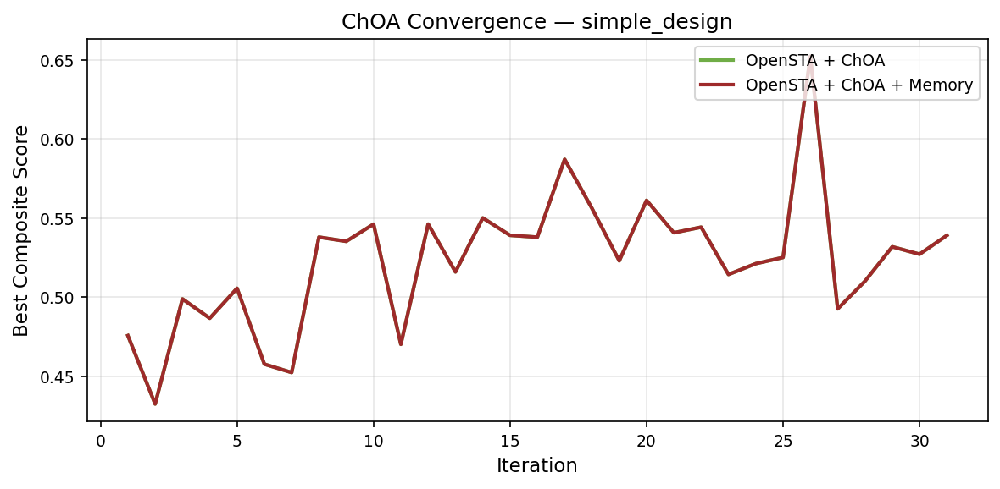

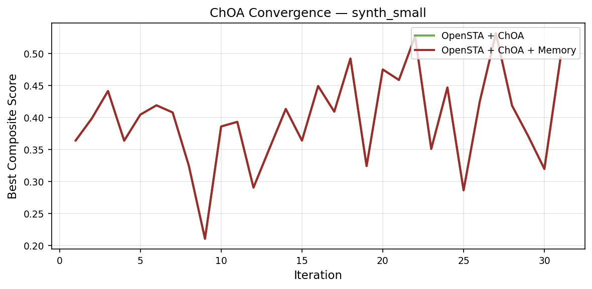

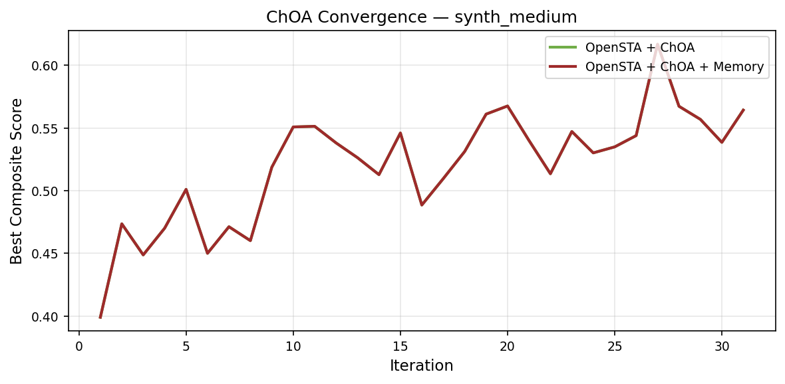

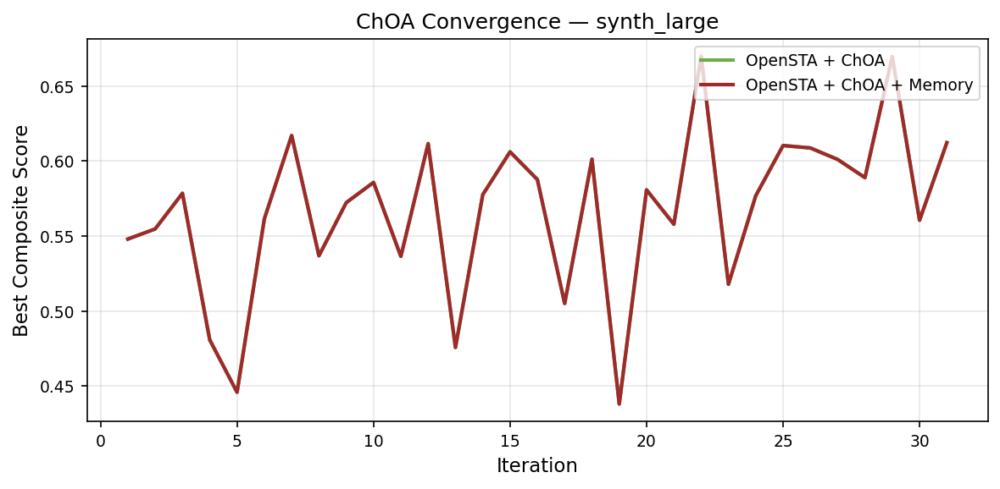

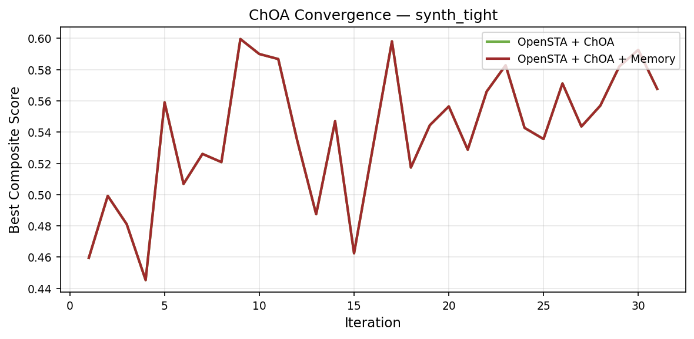

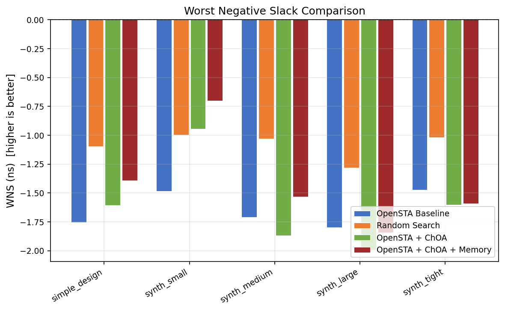

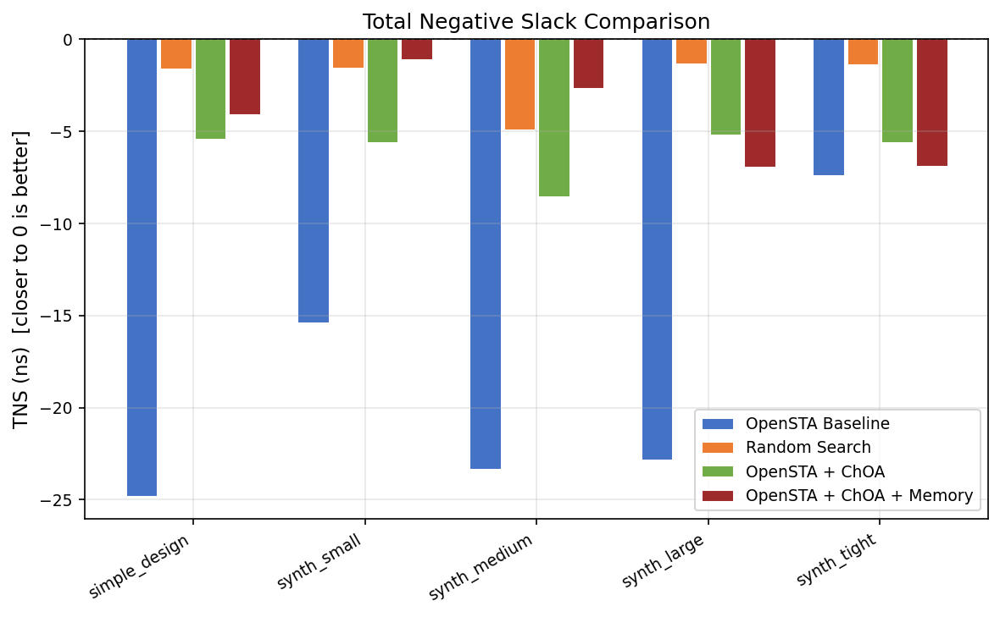

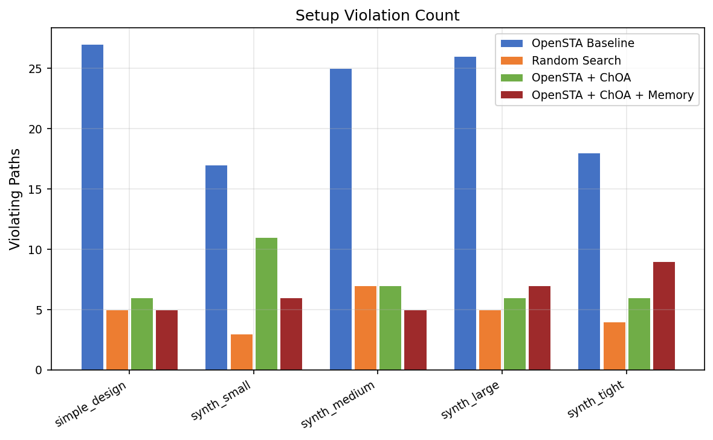

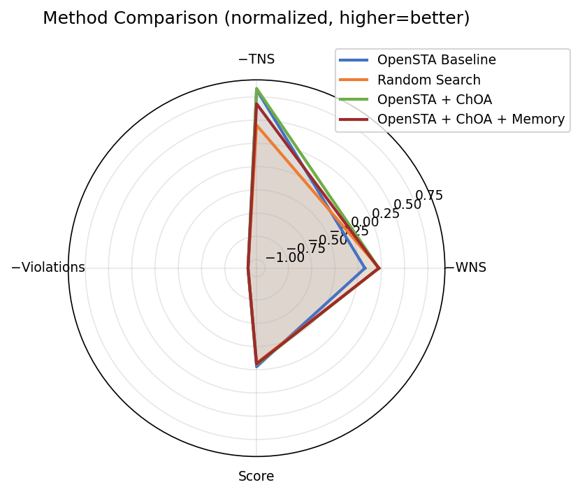

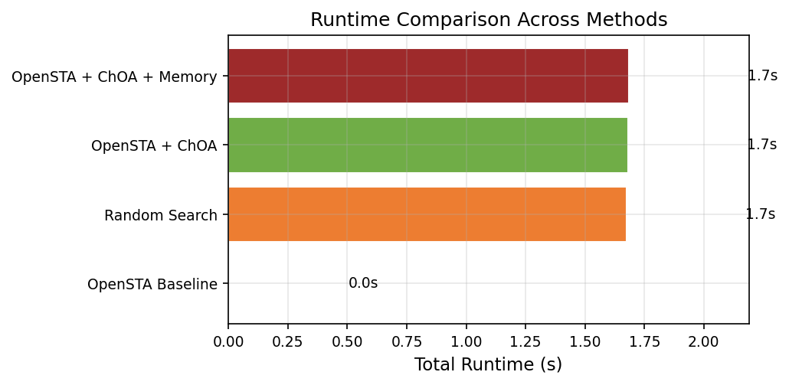

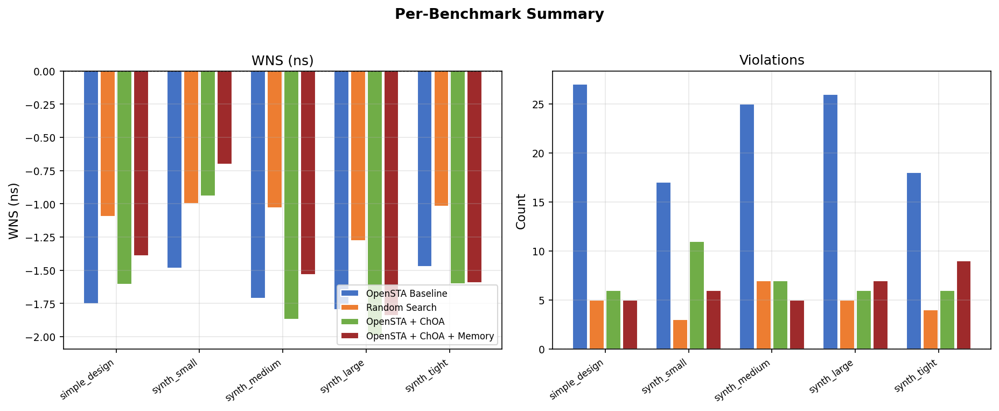

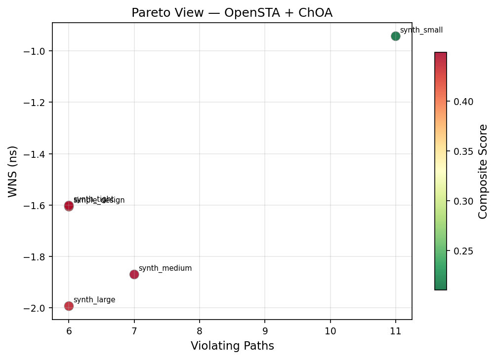

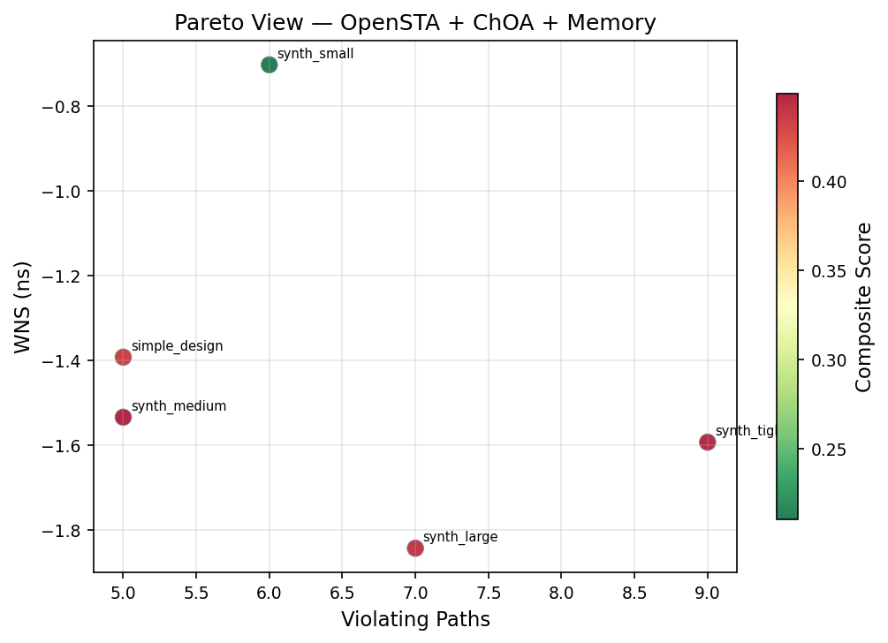

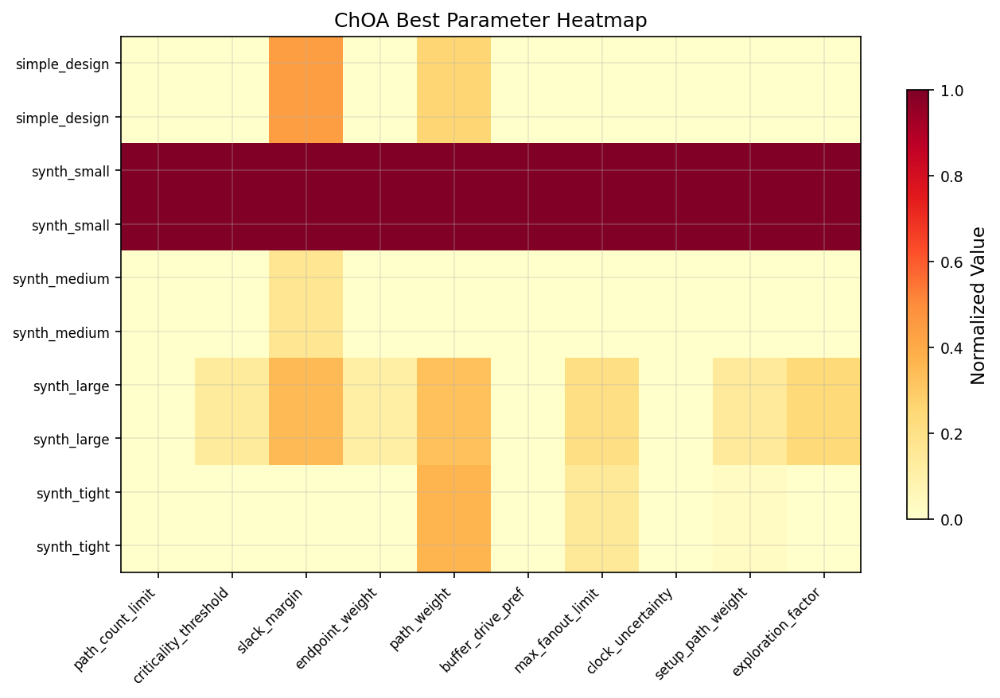
<!-- STA:FIGURES:END -->

---

## Output Files

| Path | Contents |
|---|---|
| `outputs/tables/all_results.csv` | Full results — all benchmarks × all methods |
| `outputs/tables/ablation_results.csv` | Ablation study results |
| `outputs/tables/convergence.csv` | Per-iteration fitness for all ChOA runs |
| `outputs/tables/eco_actions.csv` | ECO buffer/gate/net suggestions per benchmark |
| `outputs/tables/best_params.csv` | Best ChOA parameter vectors per benchmark |
| `outputs/figures/*.png` | 14 plots (white bg, 150 dpi, tight layout) |
| `outputs/logs/*.log` | Timestamped run logs |
| `outputs/sta_work/*.tcl` | Auto-generated OpenSTA Tcl scripts |
| `outputs/sta_work/*_report.txt` | Raw OpenSTA timing reports |

---

## Notes

<!-- STA:NOTES:BEGIN -->
> **Note:** OpenSTA not detected — results are SIMULATED (synthetic model). Install OpenSTA and set `OPENSTA_BIN` to run real timing analysis.

**Skipped benchmarks (external collateral not present):**
- `c17` through `c7552`: ISCAS-85 — required file missing
- `s27` through `s9234`: ISCAS-89 — required file missing
- IPSD/TAU circuits: required file missing

See [benchmarks/README.md](benchmarks/README.md) for preparation instructions.
<!-- STA:NOTES:END -->

---

## Reproduction Commands

<!-- STA:COMMANDS:BEGIN -->
```bash
# 1. Install dependencies
pip install -r requirements.txt

# 2. Run with synthetic benchmarks (no OpenSTA required)
python main.py run --config configs/default.yaml

# 3. Full evaluation (all methods)
python main.py eval --config configs/default.yaml

# 4. Ablation study
python main.py ablation --config configs/ablation.yaml

# 5. Generate report + update README
python main.py report

# 6. Docker (full OpenSTA build)
make docker-build
make docker-run
```
<!-- STA:COMMANDS:END -->

---

## License

- **sta-choa framework** — MIT License, Copyright © 2024 sta-choa project
- **OpenSTA / Parallax STA** — GNU GPL v3, Copyright © 2019 Parallax Software, Inc.  
  Full license: <https://github.com/The-OpenROAD-Project/OpenSTA/blob/master/LICENSE>
- **Synthetic Liberty / Verilog / SDC** — MIT License, original work, not derived from any PDK
- **ChOA algorithm** — Khishe, M., & Mosavi, M. R. (2020). *Expert Systems with Applications*, 149, 113338. <https://doi.org/10.1016/j.eswa.2020.113338>

> Upstream OpenSTA copyright and GPL notices are preserved verbatim in `docker/Dockerfile` and `scripts/build_opensta.sh`. Do not remove or alter them.
